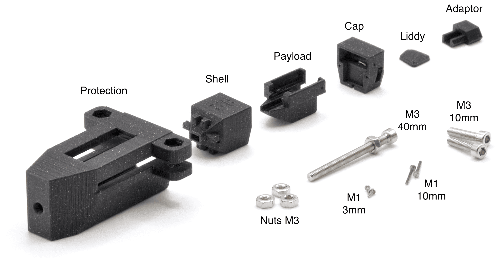
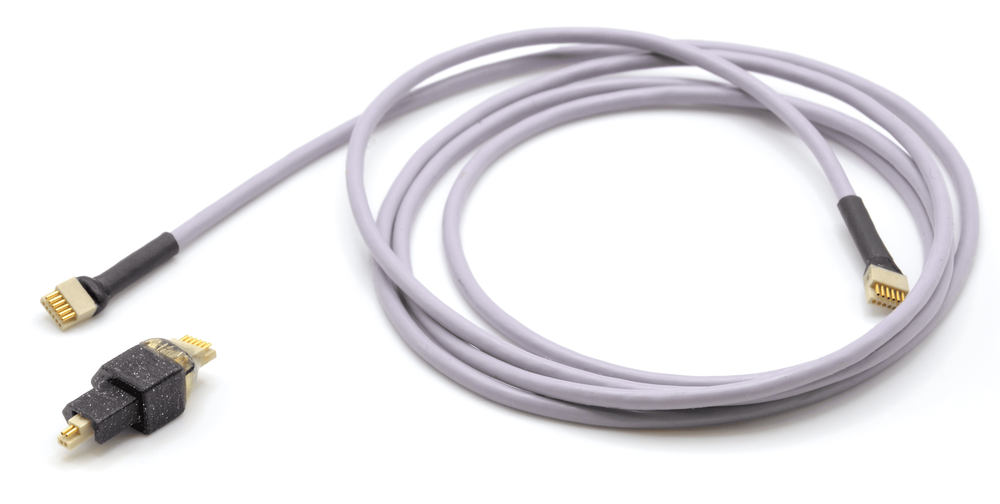
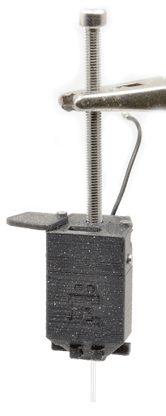

# Natreshka - Neuropixels 2.0 implant ([pdf](https://github.com/evamargin/natreshka/blob/main/Natreshka%20-%20Neuropixels%202.0.pdf))

## 1. Introduction

**Natreshka** is an open-source implantation system designed for Neuropixels 2.0, offering a secure, modular, and user-friendly solution for chronic recordings. The implant is lightweight (3.8 g), compact (14.6 × 14.2 × 26 mm), and fully 3D-printable, requiring only standard M1/M3 screws and nuts. Beyond its minimalistic design, Natreshka enables easy manual implant assembly, fast and precise implantation under different angles, manual **stereotax-free** probe recovery, and protected storage of assembled probes (Fig. 1). Successfully tested in freely moving gerbils and rats, Natreshka streamlines implantation procedures, reduces surgery time, and enhances animal welfare, making it an efficient and accessible tool for neuroscience research.

This guide will take you through every step - from printing and assembling to implantation and recovery - while highlighting pitfalls and offering practical tips for a smooth operation.

  

**Figure 1.** Our view.

- [1. Introduction](#1-introduction)
- [2. Materials and equipment](#2-materials-and-equipment)
  - [2.1. List of printed and sourced parts](#21-list-of-printed-and-sourced-parts)
    - [2.1.1. Parts list (3D printed)](#211-parts-list-3d-printed)
    - [2.1.2. Parts list (non-printed)](#212-parts-list-non-printed)
  - [2.2 Tools Required](#22-tools-required)
    - [2.2.1. Recommended 3D printers, filaments](#221-recommended-3d-printers-filaments)
    - [2.2.2. Assembly tools](#222-assembly-tools)
- [3. 3D printing the components](#3-3d-printing-the-components)
  - [3.1. 3D printing setting](#31-3d-printing-setting)
  - [3.2. Post-Printing Processing](#32-post-printing-processing)
- [4. Natreshka’s lifecycle](#4-natreshkas-lifecycle)
  - [4.1. Build a payload](#41-build-a-payload)
  - [4.2. Assemble](#42-assemble)
    - [4.2.1. Prepare the parts](#421-prepare-the-parts)
    - [4.2.2. Assemble the implant](#422-assemble-the-implant)
    - [4.2.3. Prepare the cable](#423-prepare-the-cable)
  - [4.3. Implant](#43-implant)
  - [4.4. Record](#44-record)
  - [4.5. Recover](#45-recover)
    - [4.5.1. Clean](#451-clean)
  - [4.6. Store](#46-store)

## 2. Materials and equipment

### 2.1. List of printed and sourced parts

  

**Figure 2.** Parts overview.

#### 2.1.1. Parts list (3D printed)

- [Payload](payload.stl)
- [Shell](shell.stl)
- [Cap](cap.stl)
- [Liddy](liddy.stl)
- [Cable adaptor](adapter.stl)
- [Protection](protection.stl)

#### 2.1.2. Parts list (non-printed)

| Name            | Description                                                                            | Quantity | Vendor                                                                                           |
| --------------- | -------------------------------------------------------------------------------------- | -------- | ------------------------------------------------------------------------------------------------ |
| Nuts M3         | DIN 934, hexagon type (6KT), A2 stainless steel                                        | 4        | [link](https://ghw-modellbau.de/DIN-934-6KT-Mutter-Edelstahl-A2-blank-M3-50-Stk)                 |
| Screw M3 40 mm  | DIN 912, cylinder head with ISK (hexagon socket / Allen key) drive, A2 stainless steel | 1        | [link](https://ghw-modellbau.de/DIN-912-Zylinderkopf-Schraube-Edelstahl-A2-blank-M3-x-30-50-Stk) |
| Screws M3 10 mm | DIN 912, cylinder head with ISK (hexagon socket / Allen key) drive, A2 stainless steel | 2        | [link](https://ghw-modellbau.de/DIN-912-Zylinderkopf-Schraube-Edelstahl-A2-blank-M3-x-30-50-Stk) |
| Screws M1 10 mm | DIN 84, cylinder head with SZ (slot) drive, A2 stainless steel                         | 2        | [link](https://ghw-modellbau.de/DIN-84-Zylinderkopf-Schraube-Edelstahl-A2-blank)                 |
| Screws M1 3 mm  | DIN 84, cylinder head with SZ (slot) drive, A2 stainless steel                         | 2        | [link](https://ghw-modellbau.de/DIN-84-Zylinderkopf-Schraube-Edelstahl-A2-blank)                 |

### 2.2. Tools Required

#### 2.2.1. Recommended 3D printers, filaments

- High-precision 3D extrusion printer (we used [Prusa MINI](https://www.prusa3d.com/product/original-prusa-mini-semi-assembled-3d-printer-enclosure-bundle/) with a classic [smooth sheet](https://www.prusa3d.com/product/smooth-pei-print-sheet/) and 0.25 nozzle)
- PLA printing material (we used [Prusament PLA Prusa Galaxy Black](https://www.prusa3d.com/product/prusament-pla-prusa-galaxy-black-1kg/))

#### 2.2.2. Assembly tools

- holder (for payload assembly)
- micro screwdriver (for M1 screws)
- hex key size 2.5 (for M3 screws)
- spanner size 5.5 (for M3 nuts)
- forceps (for handling the probe, cleaning 3D printed parts, etc)
- syringe needles d=0.9 (for cleaning 3D printed parts)
- epoxy (for gluing the probe to the payload)

  

**Figure 3.** Tools overview.

## 3. 3D printing the components

### 3.1. 3D printing setting

The position of the details is important (see Fig. 4). Printing settings are available as a G-code (link).

  

**Figure 4.** Settings for 3D printing of the implant parts.

### 3.2. Post-Printing Processing  

  

**Figure 5.** Cleaning of the 3D printed parts.

- Remove all printing supports using forceps. 
- Ensure proper cleaning of the inner corners of the payload balcony (see Fig. 5A).
- Clean the cap and the shell holes (shown in Fig. 5B, 5C) using a needle (d=0.9). Leave the other holes as it is to maintain screw grip.
- Clean out the M3 nut slot in the cap (Fig. 5B) using sturdy forceps. This area is tricky - make sure you clean it properly.

**Tip #1:** If parts don’t fit properly (e.g., M3 nuts in the protection), check that all support material has been thoroughly removed. Incomplete cleaning is a common cause of misalignment.

**Tip #2:** Print quality matters. All surfaces should be smooth, and the payload should slide into the shell easily. Sometimes, one needs to slide details in and out several times to break them in. If it still catches, consider reprinting with a higher resolution.

**Tip #3:** Check that all printed parts have straight walls where intended. When the payload is placed in the shell and covered with the cap, the gap between the shell and cap should be uniform. If there are large deviations, reprint the affected part.

## 4. Natreshka's lifecycle

### 4.1. Build a payload

  

**Figure 6.** Building a payload step by step.

1. Fix the payload in the holder (Fig. 6A).
2. Apply epoxy to the surface where the probe will be mounted.
3. Remove the probe from its case and place it onto the glued area (Fig. 6B).
4. Gently press on the metal/silicone cap to ensure even contact.
5. Wait ~5 minutes for the glue to set.
6. Remove the payload from the holder, flip it upside down, and fix it back in (Fig. 6C).
7. Apply tape to the holder to protect the shanks (Fig. 6D).
8. Route the flex cable under the plastic beam (Fig. 6E).
9. Connect the headstage to the flex cable (Fig. 6F).
10. Insert the headstage into the payload balcony from the back, gently bending the flex cable (Fig. 6G).

**Tip #4:** Don’t worry about bending the cable during assembly - the required bend won’t affect signal quality or long-term stability.

**Tip #5:** In this design, the ground wire connects directly to the headstage, not the flex cable (Fig. 7). Solder it to the headstage ground pad in advance. This setup has been tested and works reliably.

**Tip #6:** The headstage should fit precisely into the payload and sit tight. If you feel some squeeze, remove the payload and thoroughly clean any 3D-printing residue from its corners before trying again. Precise placement of the headstage is very important to get Omnetics connected in the assembled implant!

  

**Figure 7.** The site for the ground wire connection on the headstage.

### 4.2. Assemble

#### 4.2.1. Prepare the parts

1. Insert two M3 nuts into the protection piece and screw in two M3 10 mm screws.
2. Insert one M3 nut into the cap from the side slot (Fig. 5B).

#### 4.2.2. Assemble the implant

**Figure 8.** Implant assembly step by step.

1. Fix the shell in the protection tightening the protection screws (Fig. 8A).
2. Insert manually the assembled payload into the shell (Fig. 8B).
3. Pre-screw the M1 3 mm screws into the side holes of the cap and M1 10mm screws on the top of the cap. Don’t forget to attach the liddy (Fig. 8C).
4. Close the shell, ensuring the ground wire sits in the groove in the cap wall (Fig. 8C).
5. Fully tighten the M1 3 mm screws to secure the cap to the payload (Fig. 8D).
6. Fully tighten the M1 10 mm screws to connect the shell and cap (Fig. 8D).
7. Loosen the protection screws, push the implant fully in, and re-tighten them. This way, the implant can be safely stored (Fig. 8E). 

#### 4.2.3. Prepare the cable 

  

**Figure 9.** Adaptor assembly.

1. Thread the Omnetics cable through the adaptor (Fig. 9A).
2. Plug the Omnetics connector into the headstage via the adaptor hole in the cap (Fig. 9B).
3. Apply a small amount of glue to the groove of the adaptor (Fig. 9B).
4. Plug the adaptor into the adaptor hole in the cap (Fig. 9C).
5. Wait ~5 minutes for the glue to set.
6. Gently unplug the adaptor from the implant (Fig. 9D).
7. Apply more glue to the outer side of the adaptor to secure the cable.
8. Once dry, test re-plugging the adaptor. If it doesn’t fit due to excess glue, file it down slightly.

**Tip #7:** Avoid using too much glue in Step 3 - it can damage the connector or headstage. If available, optically curable dental cement can be used here: apply, plug in the adaptor, and cure with UV. However, for Steps 5 and 6, superglue is better - dental cement may not bond well to plastic.

**Tip #8:** If you prefer using the Omnetics cable instead of the classic Neropixel twisted pair, you can make an adaptor from 4-pin Omnetics to 12-pin Omnetics (Fig. 10)

  

**Figure 10**. 4 to 12 pins Omnetics adaptor.

## 4.3. Implant

To fix the implant in a stereotax, we place M3 40mm screw in the cap (Fig. 11) and atteach it to a custom holder. 

  

**Figure 11.** Fully assembled probe ready for the implantation. 

**Tip #9:** Test the assembled probe before the implantation: connect it to the system to confirm it's detected. Detection might fail if the headstage and the flex cable were not connected properly.

**Tip #10:** Use Vaseline to seal the window where the shanks exit the implant. 

## 4.4. Record

- Gently restrain the animal, open the lid, and plug in the adapter to begin recording.
- When finished, unplug it and close the lid to protect the headstage and connector.

## 4.5. Recover

  

**Figure 12.** Probe recovery step by step.

1. Anesthetize the animal.
2. Unscrew the M1 10 mm screws from the cap and remove the liddy (Fig. 12A). 
3. Attach the protection piece as shown in Fig. 12B.
4. Prepare the M3 40 mm screw by placing an M3 nut onto it.
5. Insert the screw through the hole in the protection and thread it into the central hole in the cap Fig. 12C).
6. Gently pull the nut downward using a spanner Fig. 12D). As the nut moves down relative to the screw, the payload (with the cap) will slowly rise out of the shell.
7. Once the shanks are fully retrieved, lift the protection with the probe vertically (Fig. 12E).
8. Transfer the payload with a cap attached into the new cap (Fig. 12F), repeating the process described in 4.2.2 Assemble the implant.

### 4.5.1. Clean

  

**Figure 13.** Cleaning the recovered probe.

1. Fix the implant in the protection in the elevated position to enable the opening of the liddy.
2. Screw the M3 40mm screw into the cap to handle the construction easier.
3. Prepare the solution for the probe cleaning (we use tergazyme for Stage 1 and isopropyl for Stage 2).
4. Place the probe in the glass with the cleaning solution (Fig. 13).

**Tip #11:** Be careful with the amount of cleaning solution. It should cover the shanks but not reach the level of the headstage.

## 4.6. Store

To store the probe safely, insert the assembled implant fully into the protection and tighten the M3 10 mm screws on the protection (Fig. 8E).
